### Benchmarks

#### 주식왕
- 부재중 기능 존재 : 단순한 랜덤 폭의 종목 가격 변동으로 큰 영향은 없음 
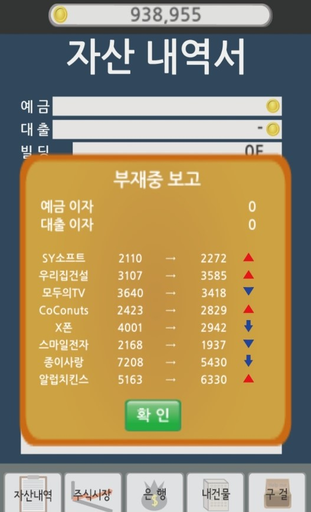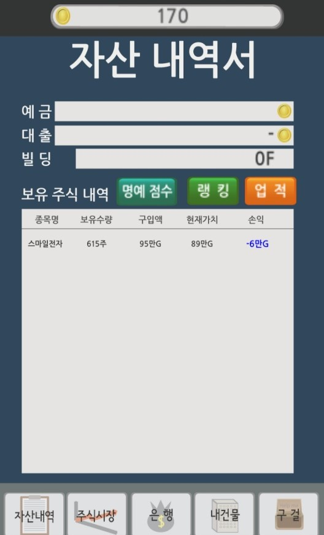
- 10초마다 카운트되며, 카운트가 끝나면 일괄적으로 가격이 변함 
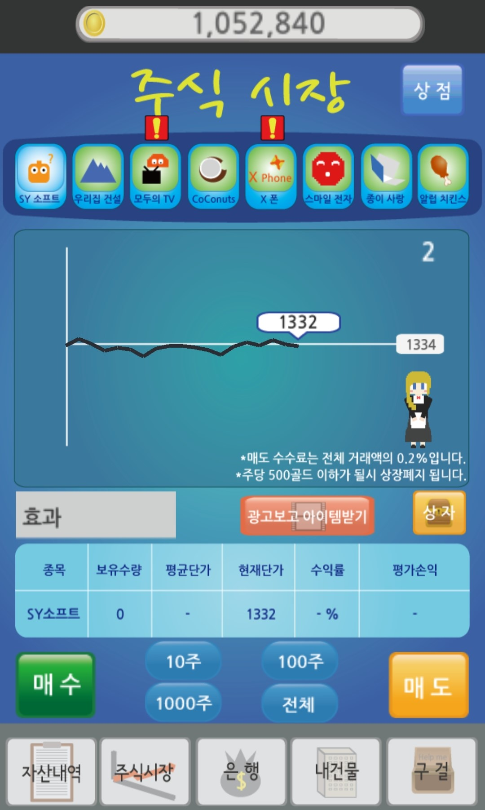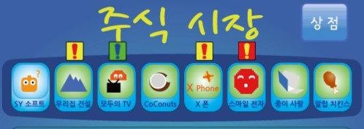 
가장 메인이 되는 화면인 ‘주식시장’ 부분임.
  -	8개의 종목이 있으며, 일괄적으로 10초 카운트 뒤에 가격 변동이 이루어짐
  -	그래프는 평균 단가선과 선그래프의 단순한 모양새
  -	일정 확률로 종목 위에 느낌표 마크가 생김
  -	초록색은 호재, 노란색은 확률이 존재하는  불확실한 정보, 빨간색은 결과를 나타냄 (각 좌, 중앙, 우) 
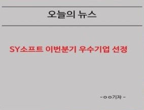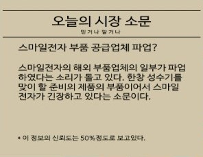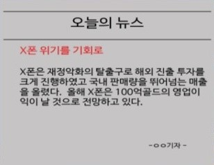
  -	그래프 우측 인물을 터치하면 어드바이스가 나오지만, 단순한 랜덤 문장 출력임
  -	보유 수량, 평균 단가, 현재 단가, 수익률, 평가손익 항목이 있음. 오후 7:32 2022-10-25주식에 있어 가장 핵심적인 부분만 남겨진 듯함

- 랭킹시스템 있음 : 인게임 머니, 명예, 기부금액 등 랭킹 컨텐츠의 다양화
  - 명예는 대량의 인게임 머니를 이용한 도박 같은 것임
  - 기부금은 일부 처음 플레이하는 유저에게 지원, 기부자는 아이템 획득 
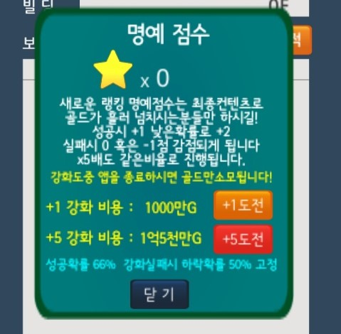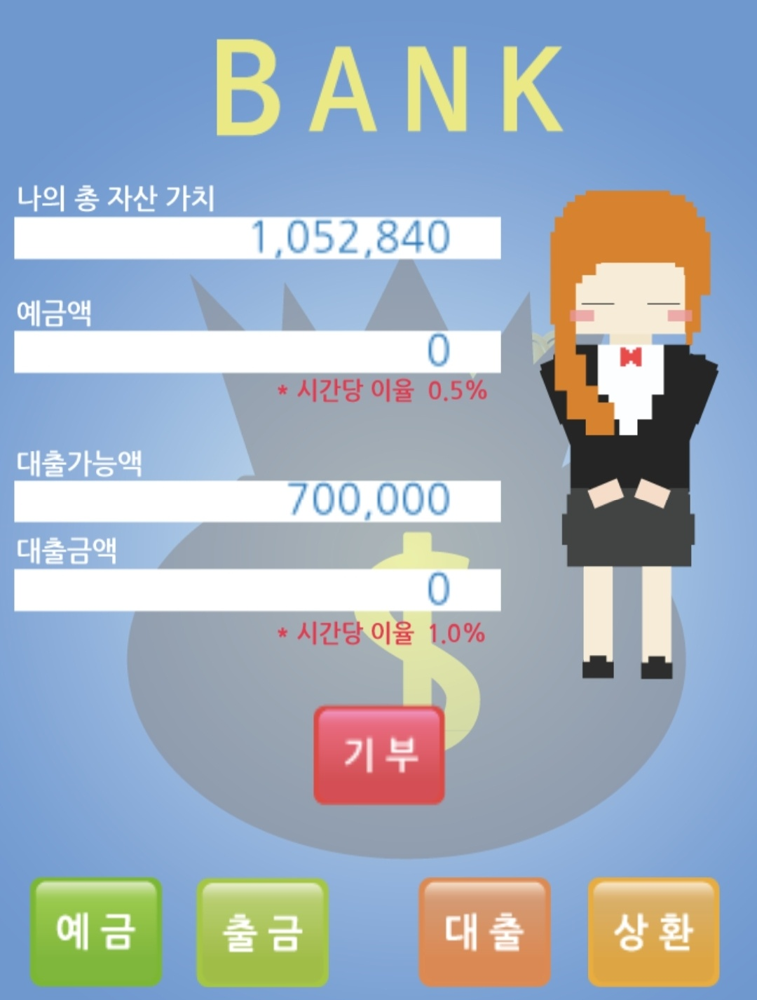
- 단순한 클리커 게임을 하면 자금 회복이 가능함

- 증시 속도 변화, 상승/하락 확률, 소문 발생, 골드 주머니 아이템이 존재 
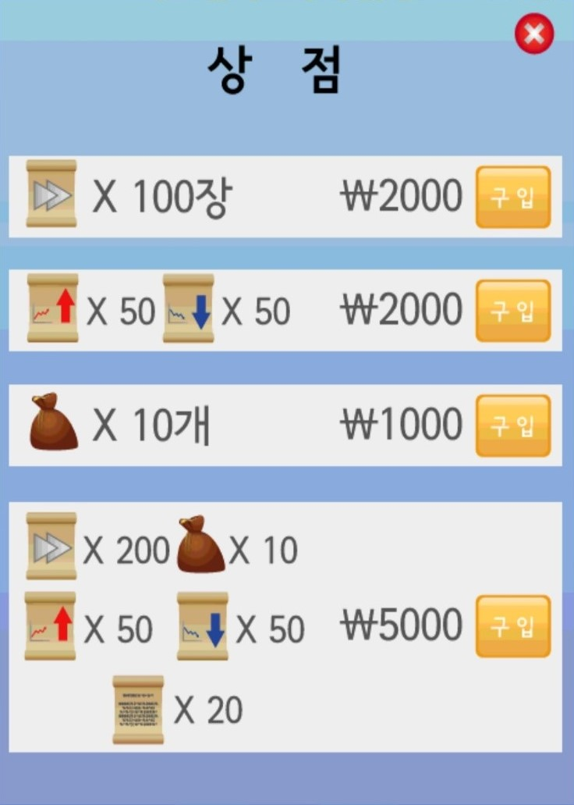 
  - 증시 속도 변화 아이템은 기존의 10초 타이머를 3초로 단축
  - 빨간 화살표 아이템은 상승장이 될 확률, 파란 화살표는 하락장이 될 확률이 30%씩 증가함
  - 주머니에는 50만 골드(인게임 화폐)가 들어있음
  - 글이 써진 아이템은 랜덤 종목에 소문을 발생시킴 

#### 결론
모의 주식 투자 앱이지만 아이템이 있고 가격 변동이나 소식 등 주식 시장이 비현실적인 부분이 존재함. 
UI 역시 많이 공들이지는 않은, 날 것의 느낌임.  
하지만 10초마다 가격이 바뀌는 '단순한 그래프'는 매 순간마다 복잡하게 가격이 바뀌는 캔들 그래프보다 보기 편한 느낌은 분명 존재함 

---

#### Stock'er
- 홈 화면에 코스피, 코스닥, 뉴욕거래소, 나스닥 항목 있음
- 각 주가 지수는 라인그래프를 통해 그려지고, 현재 지수와 등락도, 변동률 순위가 표기됨
- 상단의 각각 아이콘 메뉴는 홈, 증시 뉴스, 랭킹, 자산 구매, 설정임 → '뉴스' 아이콘처럼 직관적이지 않은 듯한 것도 존재. 
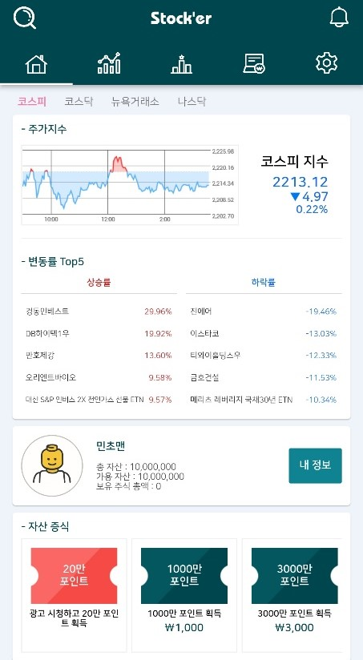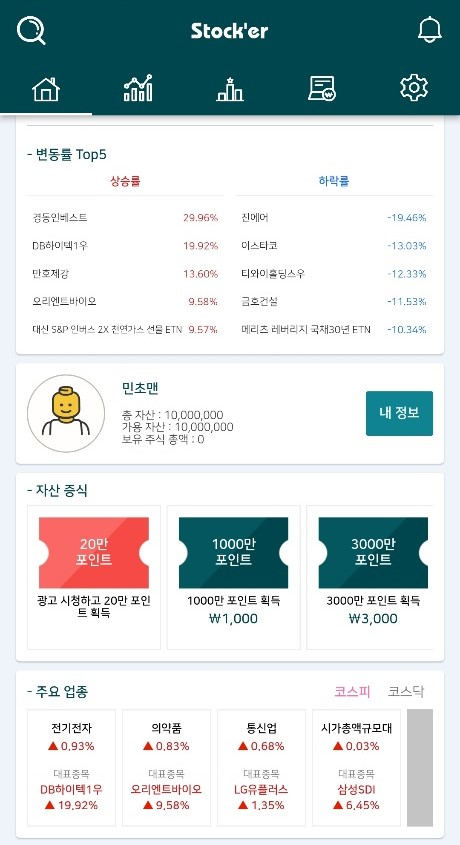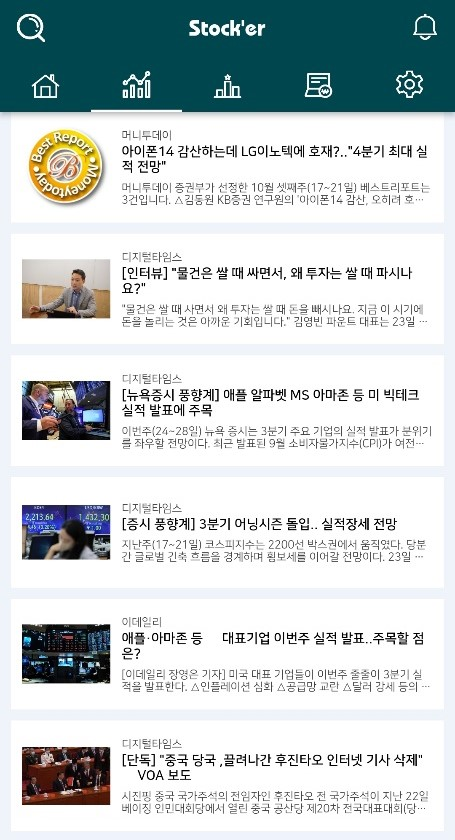 
- 좌상단 버튼으로 주식 종목명 혹은 코드로 검색이 가능함 
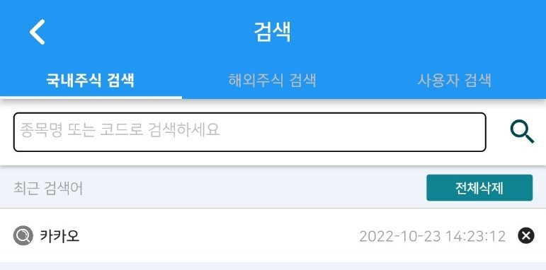
- 기업 정보, 관련 뉴스, 동일 업종이나 거래량, 매수가능 수, 저고가 등의 정보가 표기되는 것은 일반 주식 거래 앱들과 거의 유사함
- 종목마다 피드로 누가 어느 가격에 얼마나 샀는지 표시됨
- 모든 종목들은 실제 현실의 주가 변동 사항을 반영하고 있음 
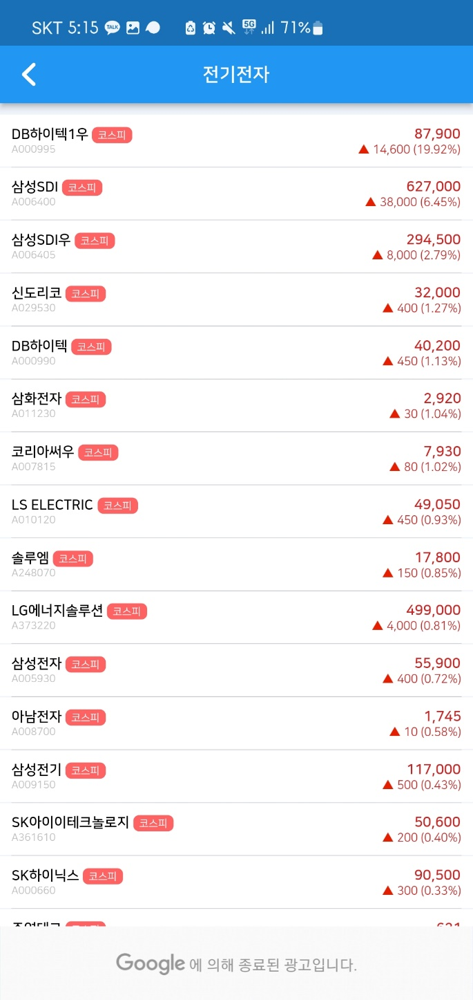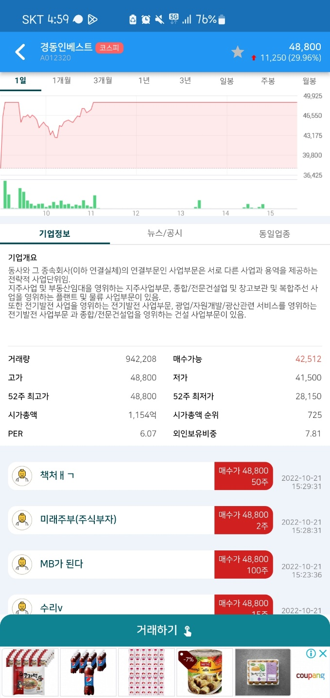 

#### 결론
UI가 단순하고 깔끔한 느낌이긴 하나 처음 시작하는 유저에게 가이드해주는 부분이 적음. 
그래프 또한 주식왕처럼 단순한 느낌을 지향하여 보기에는 편하지만, 원하는 업종을 찾는 데에는 검색이 가장 최선의 방법인 것이 아쉬움 
매도, 매수는 간편한 듯. 다른 사람들이 얼마에 어느 정도나 매매를 하는지 보여주는 것도 이용자에게 충분한 영향이 있을 듯함 
이전에 주식 투자를 이미 해본 사람들 상대로는 괜찮은 연습 어플리케이션일 듯함 

---

#### 주식게임 (Stock Exchange Game)
- 초기의 자금을 가지고 시작하며, 각종 뉴스를 토대로 자원을 사고 팔며 차익을 내는 게임임.
- 게임 실행 시 짧은 튜토리얼을 보여주며, 이후 해야 할 일을 알려줌. 
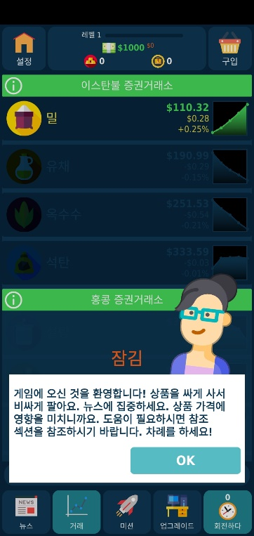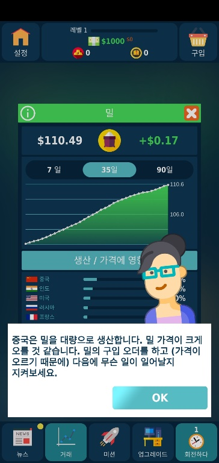 
- 종목들은 목록화 되어있고, 현재가와 등락 정보, 그래프까지 간략하게 표기됨
- 클릭 시 더 자세한 정보가 출력되는데, 이 화면에서 매매 및 투자가 가능하며, 업그레이드를 통해 잠긴 거래소를 열어가며 거래 종목을 늘림. 
- 최우하단 ‘회전’ 버튼을 누르면 날짜가 한 번 흐르며, 이 때 뉴스 발생이나 종목 가격의 변화가 이루어짐.
- 이 게임의 주 목적은 매매를 통한 차익을 최대로 활용하는 것. 
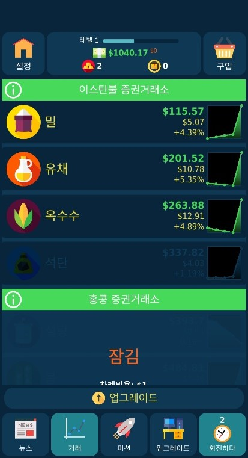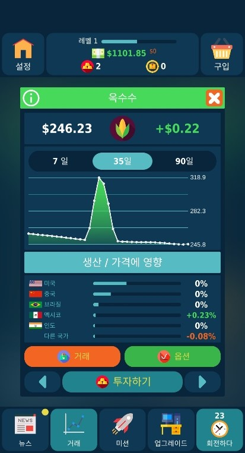 
- 뉴스 탭을 클릭하면 여태 발생한 뉴스들이 목록화되어 나옴.
- 이 뉴스들에는 내용, 기간, 발생 장소 등이 포함되며, 종목을 사고파는 데에 반영됨. 
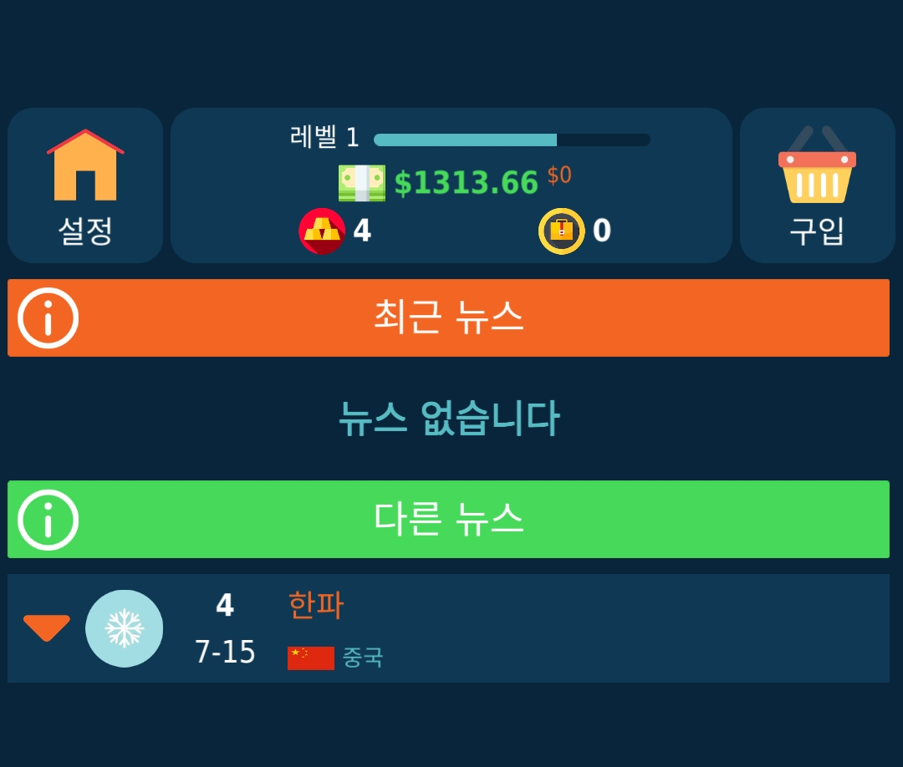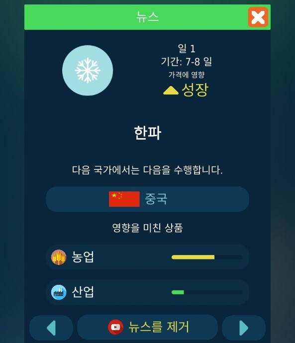 
- 재무부 화면은 설정과 구입 사이의 버튼으로 들어갈 수 있는 프로필 같은 요약 화면임.
- 기간에 따른 수익 변화 등의 통계를 보이며, 부족한 자금 대출을 받을 수 있음.
- 억만장자 등급은 단순한 랭킹 기능임. 
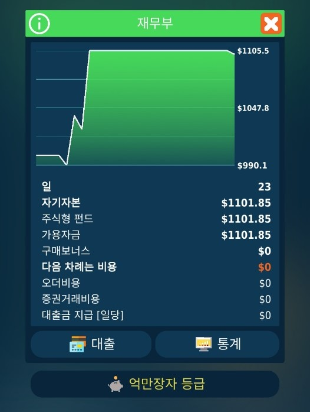
- 설정은 언어, 게임 재시작 밖에 존재하지 않으며, 아이템 역시 게임 내에서 사용하는 재화 뿐임.
- 보통의 게임에서 아이템으로 등장하는 기능은 업그레이드 장치로서 등장함.
- 업그레이드는 각각의 특별한 기능을 수행하며, 구매 시 작업 공간에 배치됨. 
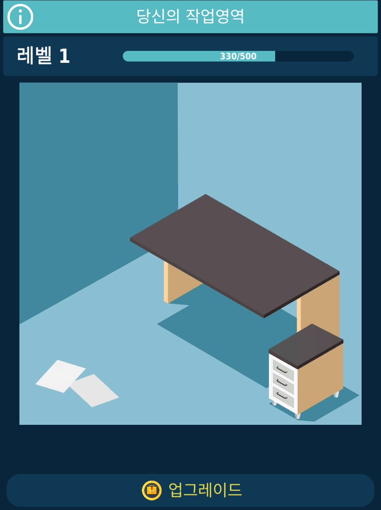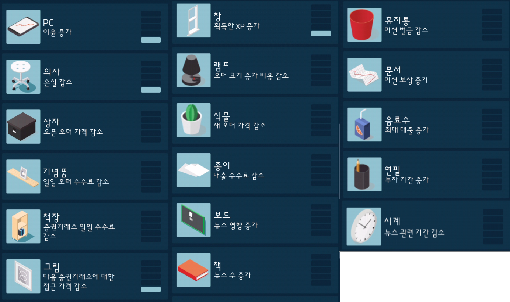 

#### 결론 
제목은 주식게임이지만, 사실상 주식보다는 뉴스에 의해 가격이 변동되는 자재의 매매를 통해 차익을 내는 단순한 게임임. 
이 게임 역시 보기 쉽고 편한 인터페이스를 위해 선 그래프를 사용한 것이 눈에 띔. 
뉴스가 게임 플레이에 영향을 주는 것은 좋은 아이디어이지만, 현실에서도 뉴스가 곧이곧대로 반영되는 것이 아닐 뿐더러, 주식왕의 선례가 있듯 이를 게임 메커니즘의 부품으로 포함시키는 것은 리스크가 커 보임; 유명무실하거나, 너무 얽매어지거나. 
작업영역 같이 개인적인 전시를 할 수 있는 공간이 있고, 업적 달성 등을 통해 그 공간을 꾸미는 요소가 있다면 일종의 동기부여가 될 수도 있다는 추측이 듦. 단, 부가 기능은 빼야 할 듯. 

---

#### UpDown
- 주식 그래프를 읽고 이를 이용해 차익을 내는 것은 이전에 조사했던 Bloomberg의 Trading Game과 아주 유사함.
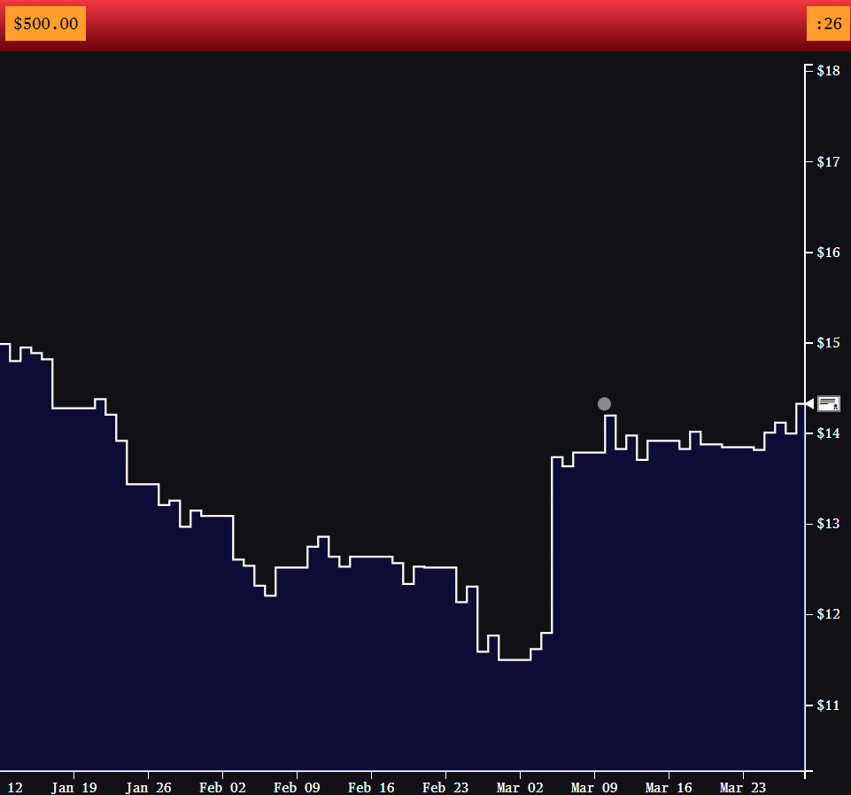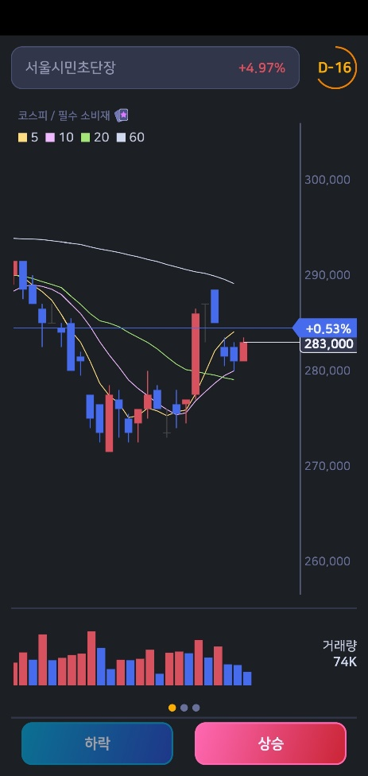The Trading Game(좌), UpDown(우) 
- 다만 게임 방식에서 차이가 나는데, Trading Game에서는 클릭 지점에서 사고 클릭을 떼면 팔며 차익을 내는 방식 
- 그러나 UpDown에서는 그래프를 읽고 상승/하락을 예상하며 차익을 냄 (쇼트/롱 방식)
- 기본적으로 멀티플레이 게임으로, 랜덤 매칭을 통한 상대와 얼마만큼의 차익을 냈는지 경쟁.
- 캔들그래프 베이스, 상대가 상승/하락을 예측한 구간, 상대의 차익, 거래량 코스피 정보가 출력.
- 인게임 중 이모티콘 소통 가능, 2배 아이템 및 상대에게 상태 안보이기를 통한 전략 구사. 
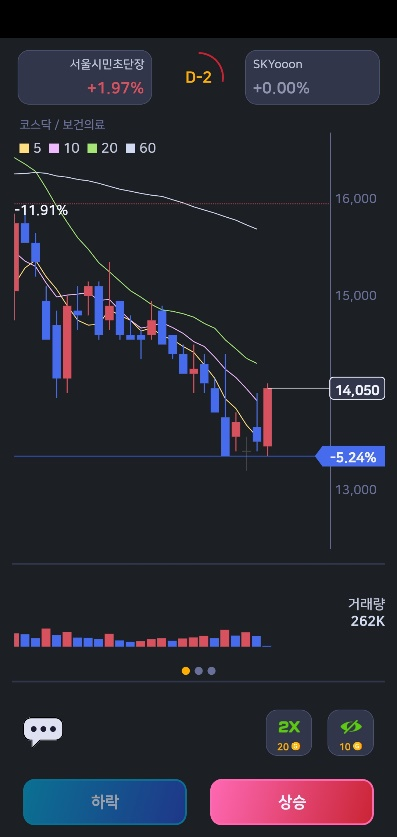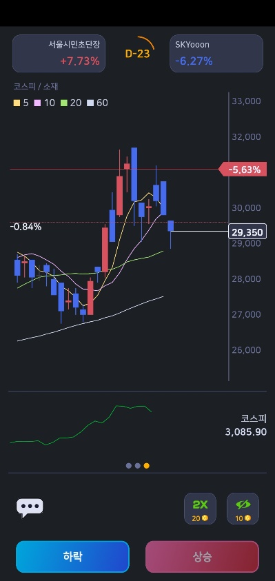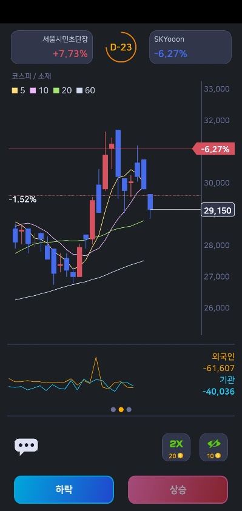
- 한 게임은 총 35번의 라운드가 흐르는 것으로 하며, 게임 내에서 D-카운트가 1 감소하기까지 약 7초가 소요됨.
  - 총 게임 플레이에 소요되는 시간은 약 4분으로, 캐주얼한 편임.
- 게임 종료 시 사용된 종목과 기간, 서로의 결과 등을 종합해서 보여줌. 
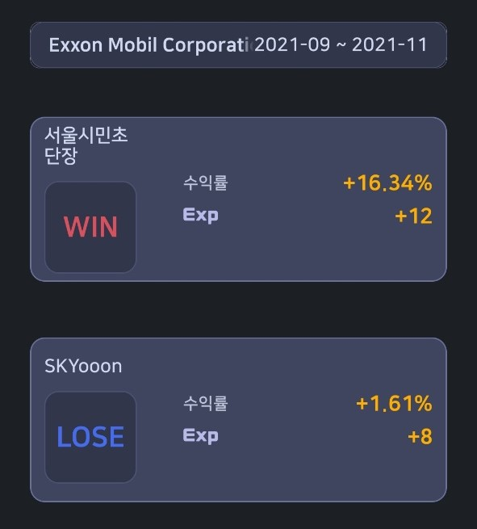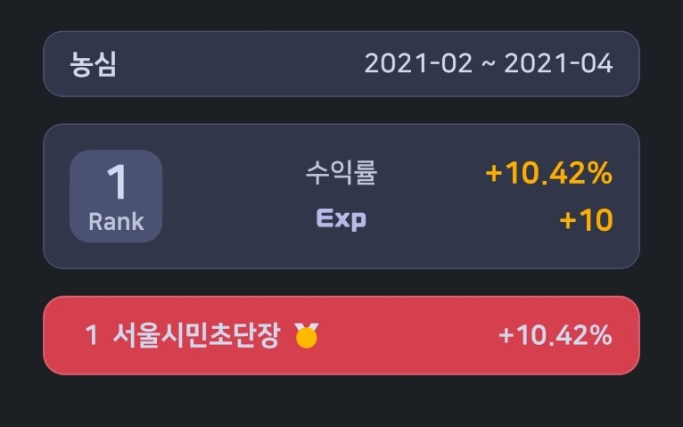
- 업종 카드라는 콘텐츠가 존재, 게임을 마칠 시 주는 큐브에서 골드와 함께 획득 가능함.
- 이 카드는 소유만으로 효과가 발생하며, 게임에서 제공된 주식 종목에 따라 랭킹 산출에 사용되는 트로피의 획득량을 올려주는 버프 효과를 줌. 
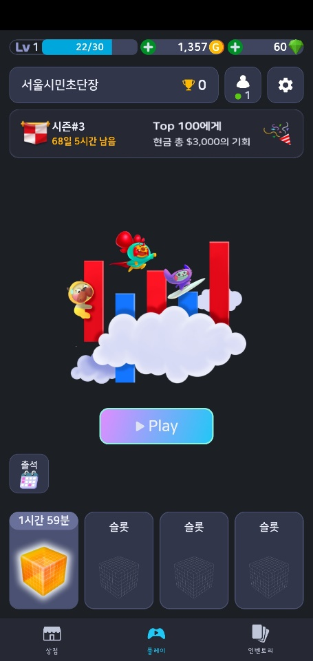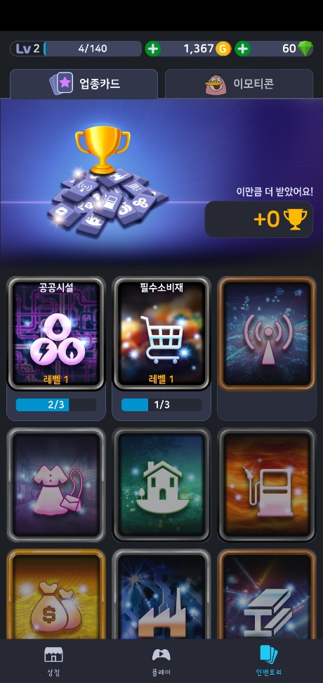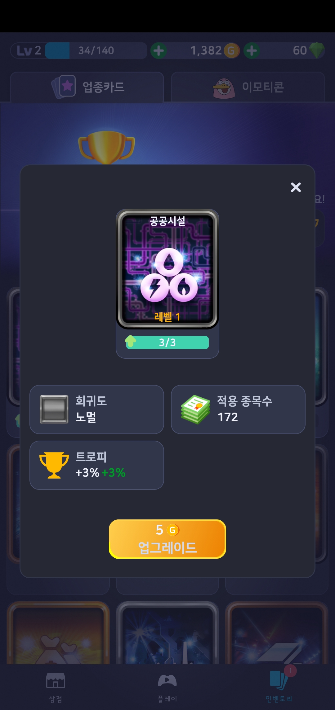 

#### 결론 
주식을 통한 경쟁 요소는 다른 게임들에서도 보인 바 있지만, 대부분은 그 결과에 집중했다면 투자하는 과정 자체를 게임으로 만들어낸 것은 독특한 부분임. 
다만 그래프가 캔들 그래프인 것이 진입 장벽을 높이고 있다고 생각함. 주식의 경험치 차이에서 이 게임에 이해도가 갈린다고 생각함. 
아이템 역시 게임에 직접적인 영향을 미치는 것은 없지만, 게임 내 랭크가 높으면 보상을 주는 시스템을 통해 유저들에게 참여를 유도하고 있음. 
UI 역시 다른 게임들에 비해 깔끔하며, 캔들 그래프를 포함해서도 가장 주식을 잘 활용한 게임이라고 느껴졌음.  
하지만 그만큼 주식에 대한 이해도를 필요로 하는 것은 아쉬운 점. 

---

### 따라서 우리가 하려는 것은 : 

**주식을 잘 모르는 이들**도 쉽게 이용할 수 있도록,  
**보기 쉬운 그래픽 인터페이스**와 핵심적인 기능을 추린 **오토 트레이딩 앱**을 만든다면 어떨까? 

- 토스 주식 탭이나 주식게임, Stock'er 게임에서 보인 것은 기존의 캔들 차트가 아닌, 평균 단가 기준선을 가진 단순한 선 그래프
  - 주식에 대한 부분을 잘 몰라도 현재 어떤 상황인지 파악하는 것은 더욱 쉬웠음
  - 기존의 주식 투자자들 역시 이용 가능하도록 숙련자용 그래픽 옵션을 따로 둔다면 둘 다 잡을 수 있을지도 (일반/공학 계산기 바뀌듯 Swap 기능)
  - 오토 트레이딩과 더불어서, 현재 그래프가 어떤 상황인지 어드바이스를 주는 것이 가능하다면? (‘주식왕’에서 아이디어)
  - 유저뿐만이 아닌 오토 트레이딩을 이용한 AI를 이용해 경쟁하는 게임? (UpDown에서 추가) 
 

#### 결론
차트를 커스터마이징 가능하게 하여 본인만의 전략 수립 및 게임 플레이가 원활하도록 함 
튜토리얼이나 가이드를 통한 예시 학습으로 주식에 대한 견문을 넓히도록 할 수 있음
